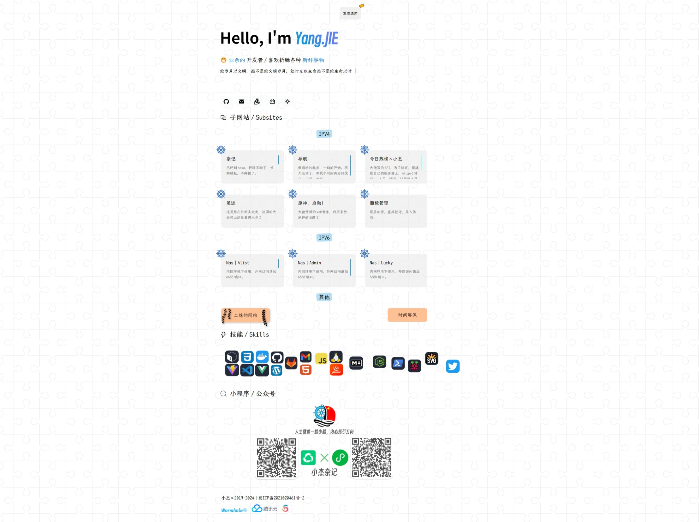

# 一个简单大气美观的 引导页

由 `Vite` & `Vue` 写的。这里只包括 `src 项目目录` 和 `public 公共目录`，及 `根 HTML 文件`。其余依赖需要自行配置。

## 配置Vite

**npm 安装**

> `npm create vite@latest`

之后选择最新的 vue，勾上。

**构建**
>
> `npm i`

不出意外，项目下就会出现 node_modules 文件夹。安装插件等其他什么的，都在其中体现。

**用于预览**

> `npm run dev`

**用于生产环境**

> `npm run build`
> 
> 在 dist 文件夹下

0.1.0 版本 / 2024年1月20日

0.2.0 版本 / 2024年7月16日 支持昼夜模式，`by vue-dark-switch`

0.3.0 版本 / 2024年8月25日 
1. pwa 支持离线访问 by `vite-plugin-pwa`
2. 打字效果 by `vue-typed-js`
3. 弹窗触发 by `vue-toastification`
4. 一些前端效果借鉴的 **https://uiverse.io/**
5. logo 是我妹给我设计的
